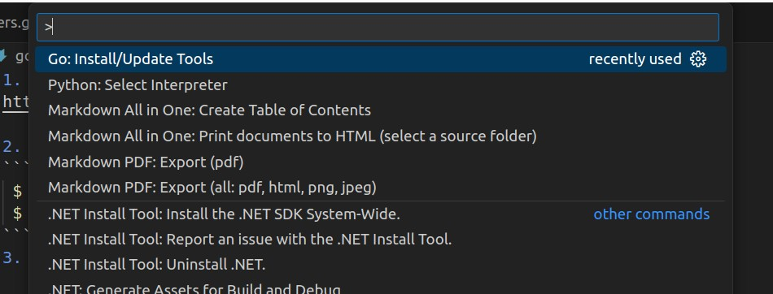
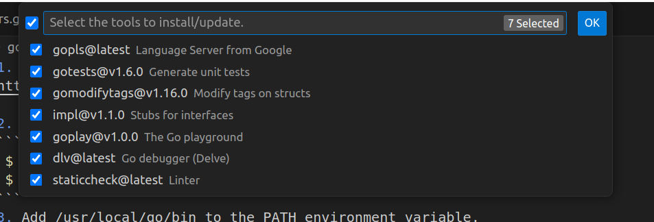
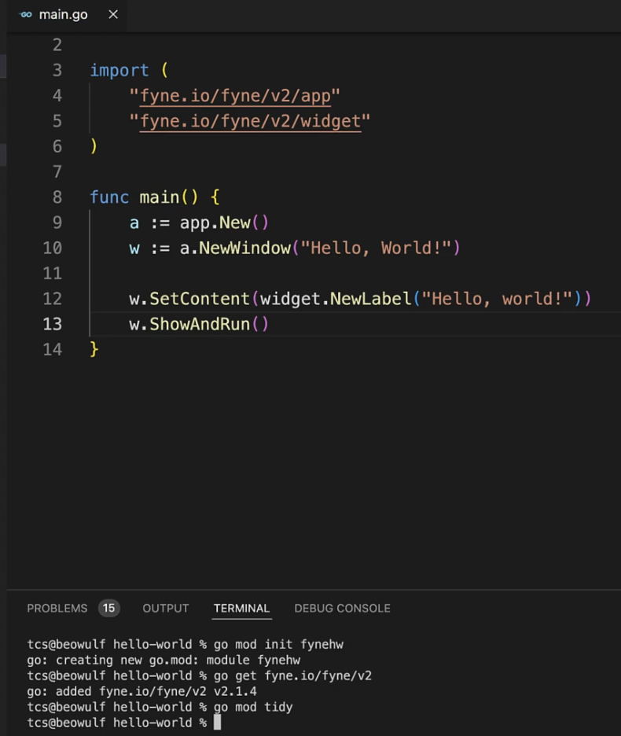

1. download the tar file 
https://go.dev/doc/install

2. run the following commands
```sh
 $ sudo rm -rf /usr/local/go
 $ sudo tar -C /usr/local -xzf go1.23.0.linux-amd64.tar.gz
```
3. Add /usr/local/go/bin to the PATH environment variable.

```sh
$ export PATH=$PATH:/usr/local/go/bin
```

1. Verify installation
```sh
 $ go version
```

# Fyne
https://developer.fyne.io

install fine in the project
```sh
go mod init my_project_name
go get fyne.io/fyne/v2
```
from VSCode, Shift+CTRL+P will bring up the command palette. type `go:install/update Tools` and then select all the tools to install and click ok



Also install the following extensions
-go
-gotemplate-syntax

### Simple Fyne Application
